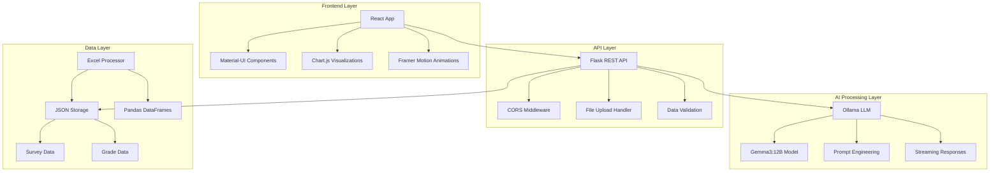
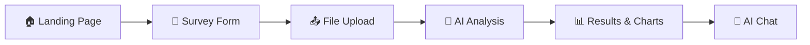

# 🎓 Hệ thống Phân tích và Đánh giá Kỹ năng Học tập Sinh viên

[](https://python.org)
[](https://reactjs.org)
[](https://flask.palletsprojects.com)
[](https://mui.com)
[](https://chartjs.org)
[](https://ollama.ai)
[](LICENSE)

> **Một hệ thống thông minh sử dụng AI để phân tích và tư vấn cải thiện kỹ năng học tập của sinh viên**

## 📋 Tổng quan dự án

Hệ thống **Student Learning Analytics** là một giải pháp toàn diện được phát triển để đánh giá, phân tích và cải thiện hiệu quả học tập của sinh viên tại **Đại học Mỏ - Địa chất (HUMG)**. Hệ thống kết hợp công nghệ **AI tiên tiến** với **giao diện hiện đại** để cung cấp những phân tích sâu sắc và tư vấn cá nhân hóa.

### 🎯 Mục tiêu chiến lược

- **🔍 Đánh giá toàn diện**: Phân tích đa chiều kỹ năng học tập qua 10 tiêu chí cốt lõi
- **📊 Phân tích thông minh**: Sử dụng AI LLM để xử lý và phân tích dữ liệu phức tạp
- **💡 Tư vấn cá nhân hóa**: Đưa ra lời khuyên và chiến lược cải thiện riêng biệt cho từng sinh viên
- **📈 Theo dõi tiến độ**: Trực quan hóa kết quả học tập qua các học kỳ với biểu đồ tương tác
- **🤖 Hỗ trợ AI**: Tương tác trò chuyện thông minh để giải đáp thắc mắc và tư vấn

## ✨ Tính năng chính

### 📊 Hệ thống khảo sát thông minh

- **🎯 Thu thập dữ liệu**: Thu thập thông tin cá nhân sinh viên (MSSV, giới tính, khoa, năm học, họ tên)
- **📋 Đánh giá đa chiều**: Đánh giá 10 tiêu chí kỹ năng học tập cốt lõi với hơn 40 câu hỏi chi tiết
- **⚡ Xử lý real-time**: Tính toán điểm phần trăm tự động cho từng kỹ năng
- **💾 Lưu trữ linh hoạt**: Tự động lưu và khôi phục dữ liệu khảo sát
- **📱 Giao diện responsive**: Tương thích đa thiết bị với UI/UX hiện đại

### 📈 Quản lý bảng điểm nâng cao

- **📤 Upload thông minh**: Hỗ trợ upload file Excel bảng điểm (.xlsx) với validation
- **🔄 Chuyển đổi tự động**: Chuyển đổi dữ liệu Excel sang JSON có cấu trúc
- **📊 Phân tích đa học kỳ**: Theo dõi tiến độ học tập qua từng học kỳ
- **📉 Thống kê chi tiết**: Tính toán điểm trung bình, phân loại kết quả, xu hướng GPA
- **🎯 Lọc dữ liệu**: Tách biệt môn học chuyên ngành và đại cương

### 🤖 Hệ thống AI phân tích ba giai đoạn

- **🔍 Giai đoạn 1**: Phân tích kỹ năng học tập chi tiết từ dữ liệu khảo sát
- **📊 Giai đoạn 2**: Đánh giá kết quả học tập từ bảng điểm và xu hướng
- **💡 Giai đoạn 3**: Tổng hợp và đưa ra tư vấn cải thiện cá nhân hóa
- **💬 Chat tương tác**: Trò chuyện với AI để giải đáp thắc mắc và tư vấn chuyên sâu
- **⏱️ Streaming real-time**: Hiển thị kết quả phân tích theo thời gian thực

### 📊 Trực quan hóa dữ liệu

- **🎯 Biểu đồ Radar**: Hiển thị tổng quan 10 kỹ năng học tập
- **🥧 Biểu đồ Pie**: Phân bổ điểm chữ theo từng môn học
- **📈 Biểu đồ Line**: Xu hướng GPA tích lũy qua các học kỳ
- **🎨 Thiết kế tương tác**: Biểu đồ có thể tương tác với animations mượt mà

## 🏗️ Kiến trúc hệ thống

### 📁 Cấu trúc thư mục

```tree
NCKH-2025/
├── 📁 Backend/                    # Backend API Server
│   ├── 📁 app/
│   │   ├── 📁 LLM/               # AI Processing Module
│   │   │   ├── 🐍 ollama_interactions.py  # Ollama API integration
│   │   │   ├── 🐍 prompts.py              # Prompt templates
│   │   │   └── 🐍 utils.py                # Data processing utilities
│   │   ├── 🐍 app.py                      # Flask main server
│   │   ├── 🐍 config.py                   # Configuration settings
│   │   └── 🐍 diem_converter.py           # Excel to JSON converter
│   └── 📄 requirements.txt               # Python dependencies
├── 📁 Frontend/                   # React Web Application
│   ├── 📁 src/
│   │   ├── 📁 components/        # React Components
│   │   │   ├── ⚛️ LandingPage.js         # Homepage
│   │   │   ├── ⚛️ Survey.js              # Survey form
│   │   │   ├── ⚛️ FileUpload.js          # File upload
│   │   │   └── ⚛️ AnalysisPage.js        # Analysis results
│   │   ├── ⚛️ App.js                     # Main App component
│   │   └── ⚛️ index.js                   # Application entry
│   └── 📄 package.json                  # Node.js dependencies
├── 📁 Database/                   # Data Storage
│   ├── 📊 khaosat.json           # Survey data
│   ├── 📊 diem.json              # Grade data
│   └── 📊 diem.xlsx              # Excel grade file
└── 📄 README.md                  # Project documentation
```

### 🔧 Kiến trúc kỹ thuật



## 🔧 Stack công nghệ

### 🐍 Backend Technologies

- **Python 3.8+** - Ngôn ngữ lập trình chính
- **Flask 2.3.3** - Lightweight web framework
- **Flask-CORS 4.0.0** - Cross-origin resource sharing
- **Pandas 2.1.0** - Data manipulation và analysis
- **OpenPyXL 3.1.2** - Excel file processing
- **Requests 2.31.0** - HTTP client library
- **Werkzeug 2.3.7** - WSGI utility library
- **Python-dotenv 1.0.0** - Environment configuration

### ⚛️ Frontend Technologies

- **React 18.2.0** - Modern UI library
- **Material-UI 5.13.0** - React component library
- **Chart.js 4.4.9** - Data visualization charts
- **Framer Motion 12.10.5** - Animation library
- **React Router DOM 6.30.0** - Client-side routing
- **Axios 1.4.0** - HTTP client for API calls
- **React Markdown 10.1.0** - Markdown rendering
- **Emotion React/Styled** - CSS-in-JS styling

### 🤖 AI & Machine Learning

- **Ollama** - Local LLM inference engine
- **Gemma3:12B** - Google's advanced language model
- **Custom Prompt Engineering** - Optimized for Vietnamese education
- **Real-time Streaming** - Live AI response streaming
- **Context Management** - Conversation history tracking

### 🛠️ Development Tools

- **Git** - Version control system
- **VS Code** - Integrated development environment
- **WSL2** - Windows Subsystem for Linux
- **Node.js 14+** - JavaScript runtime
- **npm** - Package manager
- **Python venv** - Virtual environment management

## 📦 Cài đặt và triển khai

### 🔧 Yêu cầu hệ thống

- **Python 3.8+** - Ngôn ngữ backend chính
- **Node.js 14+** - Runtime cho frontend
- **Ollama** - AI LLM inference engine
- **Git** - Version control system
- **8GB RAM** - Khuyến nghị để chạy LLM model

### � Cài đặt Backend

**Bước 1: Tạo môi trường ảo Python**

```bash
cd Backend
python -m venv venv

# Kích hoạt môi trường ảo
# Linux/Mac:
source venv/bin/activate
# Windows:
venv\Scripts\activate
```

**Bước 2: Cài đặt dependencies**

```bash
pip install -r requirements.txt
```

**Bước 3: Cấu hình môi trường**

```bash
# Tạo file .env (tuỳ chọn)
echo "OLLAMA_API_URL=http://192.168.2.114:11434/api/chat" > .env
echo "OLLAMA_MODEL=gemma3:12b" >> .env
echo "FLASK_DEBUG=True" >> .env
```

**Bước 4: Chạy server**

```bash
python app/app.py
```

### ⚛️ Cài đặt Frontend

**Bước 1: Cài đặt dependencies**

```bash
cd Frontend
npm install
```

**Bước 2: Chạy ứng dụng development**

```bash
npm start
```

**Bước 3: Build production (tuỳ chọn)**

```bash
npm run build
```

### 🤖 Cài đặt Ollama AI

**Linux/WSL:**

```bash
# Cài đặt Ollama
curl -fsSL https://ollama.com/install.sh | sh

# Pull model Gemma3
ollama pull gemma3:12b

# Chạy Ollama server
ollama serve
```

**Windows:**

```powershell
# Download và cài đặt từ https://ollama.com/download
# Sau đó chạy:
ollama pull gemma3:12b
```

### 🌐 Cấu hình mạng

- **Backend API**: `http://localhost:5000`
- **Frontend Web**: `http://localhost:3000`
- **Ollama API**: `http://localhost:11434/api/chat`
- **CORS**: Đã được cấu hình cho development

### 🔍 Kiểm tra cài đặt

```bash
# Kiểm tra Backend
curl http://localhost:5000/api/get-data

# Kiểm tra Ollama
curl http://localhost:11434/api/version

# Kiểm tra Frontend
# Mở browser tại http://localhost:3000
```

## 🎯 Hướng dẫn sử dụng chi tiết

### 📝 Bước 1: Khảo sát kỹ năng học tập

1. **Truy cập ứng dụng** tại `http://localhost:3000`
2. **Điền thông tin cá nhân**:
   - Mã số sinh viên (MSSV)
   - Giới tính
   - Khoa/Ngành học
   - Năm học
   - Họ và tên
3. **Thực hiện khảo sát** 10 tiêu chí kỹ năng:
   - ⭐ Thái độ học tập
   - 📱 Sử dụng mạng xã hội
   - 👨‍👩‍👧‍👦 Gia đình & Xã hội
   - 👥 Bạn bè
   - 🏫 Môi trường học tập
   - ⏰ Quản lý thời gian
   - 📚 Tự học
   - 🤝 Hợp tác nhóm
   - 🧠 Tư duy phản biện
   - 💡 Tiếp thu & xử lý kiến thức
4. **Lưu tự động**: Hệ thống tự động lưu tiến độ và cho phép tiếp tục sau

### 📊 Bước 2: Upload bảng điểm

1. **Chuẩn bị file Excel** (.xlsx) với định dạng bảng điểm chuẩn
2. **Kéo thả hoặc chọn file** trong giao diện upload
3. **Xác minh dữ liệu**: Hệ thống tự động validate và convert sang JSON
4. **Xem preview**: Kiểm tra dữ liệu đã được xử lý chính xác

### 🤖 Bước 3: Phân tích AI thông minh

1. **Khởi chạy phân tích**: Click nút "Bắt đầu phân tích AI"
2. **Theo dõi real-time**:
   - 🔍 **Giai đoạn 1**: Phân tích kỹ năng học tập (2-3 phút)
   - 📊 **Giai đoạn 2**: Đánh giá kết quả học tập (2-3 phút)
   - 💡 **Giai đoạn 3**: Tổng hợp và tư vấn (3-4 phút)
3. **Xem biểu đồ**: Biểu đồ Radar, Pie, Line tự động hiển thị
4. **Chat với AI**: Đặt câu hỏi và nhận tư vấn chuyên sâu

### 📈 Bước 4: Xem kết quả và tương tác

1. **Đọc phân tích chi tiết** từ 3 giai đoạn
2. **Tương tác với biểu đồ** để xem chi tiết từng điểm dữ liệu
3. **Chat với AI** để:
   - Giải thích các kết quả phân tích
   - Đưa ra lời khuyên cụ thể
   - Tư vấn kế hoạch cải thiện
   - Trả lời các câu hỏi về học tập

## 📊 Cấu trúc dữ liệu

### 📝 Dữ liệu khảo sát (khaosat.json)

```json
{
  "thong_tin_ca_nhan": {
    "ma_so_sinh_vien": "20214XXX",
    "gioi_tinh": "Nam/Nữ",
    "khoa": "Công nghệ thông tin",
    "nam_hoc": "2024",
    "ho_ten": "Nguyễn Văn A"
  },
  "thoi_gian_nop": "2024-12-24 10:30:00",
  "Thai_do_hoc_tap": {
    "tong_so_cau_hoi": 5,
    "phan_tram_diem": 85.5
  },
  "Su_dung_mang_xa_hoi": {
    "tong_so_cau_hoi": 5,
    "phan_tram_diem": 72.0
  }
  // ... các kỹ năng khác
}
```

### 📊 Dữ liệu bảng điểm (diem.json)

```json
{
  "data": {
    "total_items": 250,
    "total_pages": 1,
    "ds_diem_hocky": [
      {
        "hoc_ky": "20241",
        "ten_hoc_ky": "Học kỳ 1 - Năm học 2024-2025",
        "dtb_hk_he10": 8.2,
        "dtb_hk_he4": 3.5,
        "dtb_tich_luy_he_4": 3.2,
        "so_tin_chi_dat_hk": 18,
        "ds_diem_mon_hoc": [
          {
            "ma_mon": "IT4943",
            "ten_mon": "Lập trình web",
            "so_tin_chi": 3,
            "diem_thi": 8.5,
            "diem_tk": 8.2,
            "diem_tk_chu": "B+",
            "ket_qua": "Đạt"
          }
          // ... các môn học khác
        ]
      }
      // ... các học kỳ khác
    ]
  }
}
```

## 🛠️ API Endpoints

| Method | Endpoint | Mô tả | Request Body | Response |
|--------|----------|-------|-------------|----------|
| `POST` | `/api/submit-survey` | Gửi form khảo sát | Survey data | Success/Error message |
| `GET` | `/api/get-khaosat-summary` | Lấy dữ liệu khảo sát | None | Survey summary |
| `POST` | `/api/upload-file` | Upload file Excel | FormData with file | Success/Error message |
| `GET` | `/api/get-data` | Lấy dữ liệu điểm | None | Grade data |
| `POST` | `/api/start-llm-analysis` | Bắt đầu phân tích AI | None | Server-Sent Events |
| `POST` | `/api/llm-chat` | Tương tác chat với AI | `{"message": "user_message"}` | Server-Sent Events |

### 📡 Server-Sent Events (SSE)

Hệ thống sử dụng SSE để streaming real-time responses:

```javascript
// Frontend code example
const eventSource = new EventSource('/api/start-llm-analysis');
eventSource.onmessage = (event) => {
  const data = JSON.parse(event.data);
  if (data.stage && data.token) {
    // Update UI with streaming content
    updateAnalysisStage(data.stage, data.token);
  }
};
```

### 🔒 Error Handling

```json
{
  "error": "Descriptive error message",
  "code": "ERROR_CODE",
  "details": "Additional error details"
}
```

## 🔒 Bảo mật và chất lượng

### 🛡️ Tính năng bảo mật

- **🔐 Input Validation**: Kiểm tra và làm sạch tất cả dữ liệu đầu vào
- **📁 File Security**: Validation định dạng và kích thước file upload
- **🌐 CORS Configuration**: Cấu hình CORS an toàn cho cross-origin requests
- **🚫 SQL Injection Prevention**: Sử dụng parameterized queries
- **🔒 Data Sanitization**: Làm sạch dữ liệu trước khi xử lý và lưu trữ

### ⚠️ Xử lý lỗi và exception

- **📁 File Validation**: Kiểm tra định dạng Excel và cấu trúc dữ liệu
- **🔗 API Error Handling**: Xử lý timeout và lỗi kết nối Ollama
- **📊 Data Format Validation**: Kiểm tra tính hợp lệ của dữ liệu survey và grades
- **🎯 User-Friendly Messages**: Hiển thị thông báo lỗi dễ hiểu cho người dùng
- **📝 Error Logging**: Ghi log chi tiết để debug và monitoring

## 🚀 Roadmap phát triển

### 🆕 Tính năng mới (v2.0)

- [ ] **📊 Advanced Analytics Dashboard**: Thống kê toàn trường và so sánh
- [ ] **🎯 Personalized Learning Path**: Lộ trình học tập cá nhân hóa
- [ ] **📱 Mobile App**: Ứng dụng di động React Native
- [ ] **📄 Export Reports**: Xuất báo cáo PDF/Word với template
- [ ] **🔔 Smart Notifications**: Hệ thống thông báo thông minh
- [ ] **🌐 Multi-language Support**: Hỗ trợ tiếng Anh và tiếng Việt

### ⚡ Cải thiện hiệu suất (v1.5)

- [ ] **💾 Redis Caching**: Cache dữ liệu phân tích để tăng tốc
- [ ] **🔄 Database Optimization**: Chuyển sang PostgreSQL/MongoDB
- [ ] **⚡ Lazy Loading**: Tải thành phần theo yêu cầu
- [ ] **🎨 UI/UX Enhancement**: Cải thiện responsive design
- [ ] **🚀 Performance Monitoring**: Theo dõi hiệu suất real-time

### 🌟 Tính năng mở rộng (v3.0)

- [ ] **🎓 Multi-University Support**: Hỗ trợ nhiều trường đại học
- [ ] **🤝 LMS Integration**: Tích hợp với Moodle, Canvas, Blackboard
- [ ] **👥 Collaborative Features**: Chia sẻ và so sánh kết quả
- [ ] **🎮 Gamification**: Thêm yếu tố game để động viên học tập
- [ ] **🔬 Research Tools**: Công cụ nghiên cứu cho giảng viên

## 🎬 Demo và minh họa

### 📹 Video Demo

[](https://youtu.be/vOCOzLpUNrc)

> 🎥 **Video Demo**: Khám phá đầy đủ tính năng của hệ thống qua video demo chi tiết

### 📸 Screenshots



## 🤝 Đóng góp và phát triển

### 👨‍💻 Guidelines cho developers

```bash
# Clone repository
git clone https://github.com/dammanhdungvn/NCKH-2025.git

# Setup development environment
cd NCKH-2025
chmod +x setup-dev.sh
./setup-dev.sh

# Create feature branch
git checkout -b feature/amazing-feature

# Make changes and commit
git commit -m "Add amazing feature"

# Push to branch
git push origin feature/amazing-feature

# Create Pull Request
```

### 🐛 Bug Reports

Vui lòng tạo **GitHub Issue** với thông tin sau:
- Mô tả chi tiết lỗi
- Các bước tái hiện
- Screenshots (nếu có)
- Environment details (OS, Browser, Python version)

## 📞 Liên hệ và hỗ trợ

### 👨‍🔬 Team phát triển

- **💻 Lead Developer**: [dammanhdungvn](https://github.com/dammanhdungvn)
- **🎓 Institution**: Đại học Mỏ - Địa chất (HUMG)
- **📧 Email**: dammanhdungvn@gmail.com
<!-- **🌐 Website**: [Project Website] -->

### 📋 Báo cáo vấn đề

- **🐛 GitHub Issues**: [Project Issues](https://github.com/dammanhdungvn/NCKH-2025/issues)
- **💬 Discussions**: [GitHub Discussions](https://github.com/dammanhdungvn/NCKH-2025/discussions)
- **📊 Project Board**: [Development Progress](https://github.com/dammanhdungvn/NCKH-2025/projects)

## 📄 Giấy phép và bản quyền

Dự án này được phát hành dưới giấy phép **MIT License** - xem file [LICENSE](LICENSE) để biết chi tiết.

```text
MIT License - Copyright (c) 2024 dammanhdungvn

Permission is hereby granted, free of charge, to any person obtaining a copy
of this software and associated documentation files...
```

## 📚 Tài liệu tham khảo

### 🔗 Documentation Links

- **🐍 Flask**: [Flask Documentation](https://flask.palletsprojects.com/)
- **⚛️ React**: [React Documentation](https://react.dev/)
- **🎨 Material-UI**: [MUI Documentation](https://mui.com/)
- **📊 Chart.js**: [Chart.js Documentation](https://chartjs.org/docs/)
- **🤖 Ollama**: [Ollama API Documentation](https://github.com/ollama/ollama/blob/main/docs/api.md)
- **🐼 Pandas**: [Pandas Documentation](https://pandas.pydata.org/docs/)

### 📖 Nghiên cứu và paper

- Educational Data Mining techniques
- Learning Analytics in Higher Education
- AI-powered Student Assessment Systems
- Vietnamese Education Technology Research

---

<div align="center">

### 🌟 Cảm ơn bạn đã quan tâm đến dự án!

**⭐ Nếu dự án này hữu ích, hãy cho chúng tôi một star trên GitHub! ⭐**

[](https://github.com/dammanhdungvn/NCKH-2025)
[](https://github.com/dammanhdungvn/NCKH-2025/fork)
[](https://github.com/dammanhdungvn/NCKH-2025)

</div>
